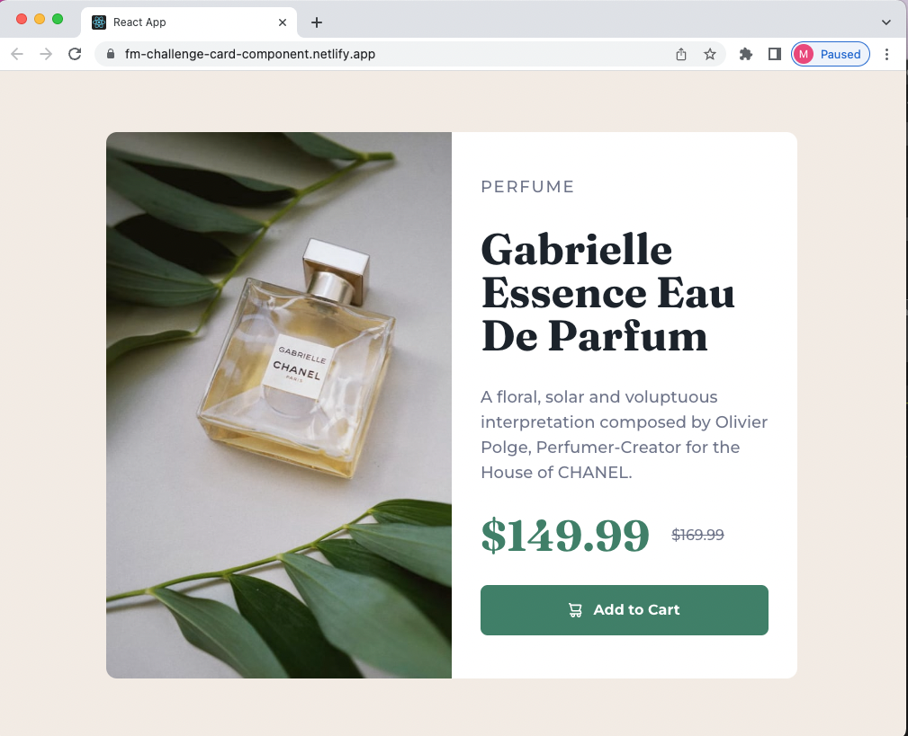

# Frontend Mentor - Product preview card component solution

- This is a solution to the Product preview card component challenge on Frontend Mentor.
- I used React and Tailwind Css to rebuild the project (responsive design).

## Links
  
- [Fontend Mentor instructions](https://www.frontendmentor.io/challenges/product-preview-card-component-GO7UmttRfa)
- [Solution deployed on Netlify](https://fm-challenge-card-component.netlify.app/)
  
### Screenshot

  

